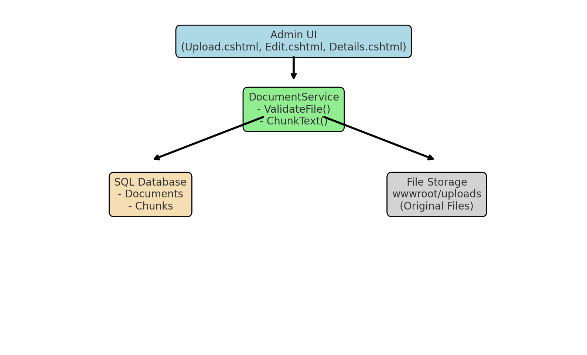

# AirNir – Generative AI Platform

## Phase 3 Documentation

### 📂 Project Structure
```
/AirNir
├── Library
│   ├── ArNir.Core     → Entities, DTOs, Config
│   ├── ArNir.Data     → DbContext, EF Migrations
│   ├── ArNir.Service  → Business logic (DocumentService, etc.)
├── Presentation
│   ├── ArNir.Admin    → ASP.NET Core MVC (AdminLTE UI)
│   ├── ArNir.Frontend → ASP.NET Core MVC (User-facing)
│   ├── ArNir.WebAPI   → API layer (future React/Angular integration)
├── sql                → SQL scripts
```

---

## Phase 3.1 – Document Ingestion & Chunking

### 🎯 Goal
Enable structured ingestion of TXT, PDF, DOCX, and Markdown files.

### 🔑 Key Features
- Entities: **Document** + **Chunk** with relationships.
- Validation rules from `appsettings.json` (`AllowedTypes`, `MaxFileSize`).
- Business logic in `DocumentService` with DTO mapping.
- Admin UI (Upload, Edit, Delete, Details, List) using AdminLTE & Bootstrap 5.
- Previews:
  - PDF → inline iframe.
  - TXT → show chunks.
  - DOCX → download fallback (no local Office Online support).
- Client-side + backend validation synced with config.
- Storage:
  - Metadata + chunks → SQL Server.
  - Original files → `wwwroot/uploads`.

### 🖼️ Architecture Diagram


### ✅ Outcome
A robust ingestion pipeline that prepares documents for vector embeddings in **Phase 3.2**.
