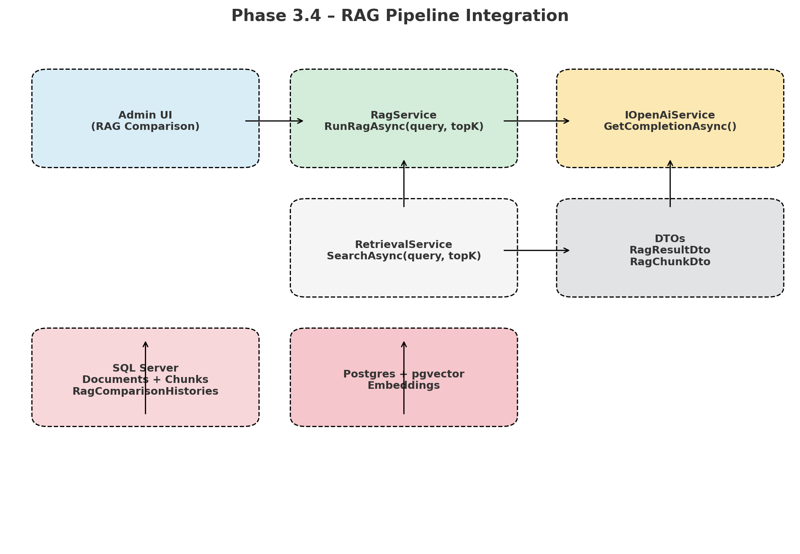

# Phase 3.4 – RAG Pipeline Integration

## ✅ Status: Completed

This phase integrated the **Retrieval Service (Phase 3.3)** with **LLM augmentation** to build a working **Retrieval-Augmented Generation (RAG) pipeline**.  
It also introduced an **Admin Debug UI (RAG Comparison Page)** and **history logging** into SQL Server.

---

## 🔹 Architecture Overview

**Flow:**
1. User query is sent to the `RagService`.
2. `RetrievalService` fetches top-K chunks (Semantic / Keyword / Hybrid).
3. Retrieved chunks are formatted with metadata (doc title, ID, retrieval type).
4. Two LLM calls are made:
   - **Baseline LLM** → query only.
   - **RAG LLM** → query + retrieved context.
5. Results are returned with:
   - Baseline answer
   - RAG-enhanced answer
   - Retrieved chunks
   - Latency metrics (Retrieval, LLM, Total)
   - SLA status badge (<1s target)
6. Results are logged into **SQL Server (`RagComparisonHistories`)** for history.

---

## 🔹 Backend Implementation

### 1. `IRagService`
- Defines `RunRagAsync(query, topK, useHybrid)` method.

### 2. `RagService`
- Calls **RetrievalService** for top-K chunks.
- Builds augmented prompt with retrieved context.
- Calls **IOpenAiService** twice (Baseline vs RAG).
- Tracks latencies with `Stopwatch`.
- Returns results in `RagResultDto`.

### 3. DTOs
- `RagResultDto` → BaselineAnswer, RagAnswer, RetrievedChunks, Latencies, SLA flag.
- `RagChunkDto` → DocumentId, DocumentTitle, ChunkText, Rank, RetrievalType.

### 4. History Logging
- New entity `RagComparisonHistory` (SQL Server).
- Saves query, answers, retrieved chunks (JSON), latencies, SLA status, timestamp.

---

## 🔹 Admin Debug UI

### Controller
- `RagComparisonController`
  - `Index()` → loads UI.
  - `Run(query)` → calls `RagService`, returns JSON.

### View (`Views/RagComparison/Index.cshtml`)
- Query input box.
- Side-by-side Baseline vs RAG cards.
- Collapsible panel with retrieved context (Doc title, ID, retrieval type).
- Latency metrics with SLA badge.

### JavaScript (`wwwroot/js/rag-comparison.js`)
- Handles Run button click.
- Shows **spinner** while processing.
- Renders results into UI.

---

## 🔹 Database Schema (SQL Server)

**Table: RagComparisonHistories**
- Id (PK)
- UserQuery
- BaselineAnswer
- RagAnswer
- RetrievedChunksJson
- RetrievalLatencyMs
- LlmLatencyMs
- TotalLatencyMs
- IsWithinSla
- CreatedAt (UTC)

---

## 🔹 Features Implemented in Phase 3.4

✅ Backend: `IRagService` + `RagService` with baseline vs RAG comparison  
✅ DTOs for structured results (`RagResultDto`, `RagChunkDto`)  
✅ History logging in SQL Server (`RagComparisonHistories`)  
✅ Admin Debug UI with:
   - Query input
   - Side-by-side answers
   - Retrieved context panel
   - Latency metrics + SLA badge
   - Processing spinner  
✅ Clean separation of SQL Server vs Postgres migrations

---

## ⚡ Expected Outcomes

- A **fully working RAG pipeline** in .NET (retrieval + augmentation + generation).  
- Transparent & debuggable pipeline (retrieved context + latency metrics).  
- Foundation for **Phase 3.5 (Admin Enhancements – RAG History Page)**.  

---

## 📂 Project Structure (Updated)

/AirNir  
├── Library  
│   ├── ArNir.Core       → Entities, DTOs, Config, Validations  
│   ├── ArNir.Data       → DbContexts (SQL Server + Postgres), EF Migrations  
│   └── ArNir.Services   → Business logic (EmbeddingService, RetrievalService, RagService)  
│  
├── Presentation  
│   ├── ArNir.Admin      → AdminLTE UI (embedding test, retrieval test, RAG comparison)  
│   └── ArNir.Frontend   → End-user chat (planned Phase 3.5+)  
│  
├── sql/  
│   ├── create_tables.sql  
│   ├── update_documents_chunks.sql  
│   └── update_embeddings.sql  
│  
└── docs/  
    ├── GenerativeAI_KnowledgeBase.md  
    ├── Phase3_RAG_Architecture.png  
    ├── Phase3.4_Architecture.png  
    └── Phase3.4_Architecture.png   (new for RAG pipeline)  

---

# ✅ Phase 3.4 Completed  
Next: **Phase 3.5 – Admin Enhancements (RAG History Page)** 🚀
