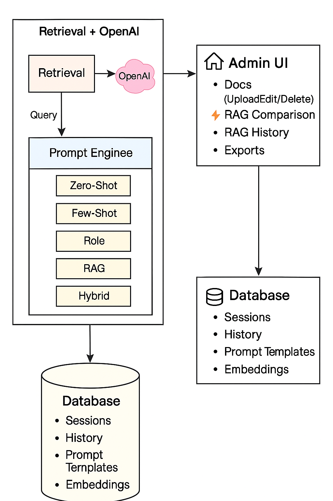

# 📘 Phase3_RAG.md

## 🔹 Phase 3.1 – Document Ingestion & Chunking
- Implemented document ingestion pipeline.  
- Documents stored in SQL Server with metadata.  
- Chunking mechanism to split documents for embeddings.  

## 🔹 Phase 3.2 – Embeddings & Vector Storage
- Integrated **pgvector (Postgres)** for embeddings storage.  
- Added EF Core integration for hybrid SQL Server + Postgres usage.  
- Implemented `EmbeddingService` for generating and persisting embeddings.  
- Admin Test UI: `/Embedding/Test` to validate similarity search.  

## 🔹 Phase 3.3 – Retrieval Service
- Implemented **semantic + hybrid retrieval**.  
- Added `RetrievalService` with similarity search logic.  
- Admin Debug UI: `/Retrieval/Test` for testing queries.  
- Introduced DTOs (`RagChunkDto`) for structured retrieval results.  

## 🔹 Phase 3.4 – Prompt Engineering
- Introduced **advanced prompt engineering** techniques:  
  - Zero-Shot  
  - Few-Shot  
  - Role Prompting  
  - RAG-Augmented  
  - Hybrid Role + RAG  
- Extended `RagService` to dynamically build prompts based on style.  
- Added `PromptStyle` column in `RagComparisonHistories` for logging.  
- Enabled prompt experimentation in Admin UI.  

## 🔹 Phase 3.5 – RAG History Enhancements
- Extended **RAG Comparison Page**:  
  - Query + PromptStyle selector.  
  - Results: Baseline vs RAG answers.  
  - Retrieved context with expandable preview.  
  - SLA badge (✅ OK / ⚠️ Slow).  
- Extended **History Page**:  
  - Filters: SLA, date range, query, PromptStyle.  
  - Details modal with chunks.  
  - Compare Mode: select multiple runs and compare side-by-side.  
  - Export: CSV/Excel (single/multiple runs, with chunks).  
- Added **Docs Module** (Upload/Edit/Delete/Rebuild embeddings).  
- Migrated to **Bootstrap 5** UI components (spinners, buttons, toggles).  

---

## 🔹 Updated Project Structure (Phase 3.5)

```
/ArNir
├── Library
│   ├── ArNir.Core → Entities, DTOs, Config, Validations
│   ├── ArNir.Data → DbContexts (SQL Server + Postgres), EF Core migrations (separate SqlServer/Postgres folders)
│   └── ArNir.Services → Business logic (EmbeddingService, RetrievalService, RagService, RagHistoryService)
│
├── Presentation
│   ├── ArNir.Admin → AdminLTE UI (ASP.NET Core MVC project)
│   │   ├── Views
│   │   ├── wwwroot/js
│   │   ├── Controllers
│   │   │   ├── Docs (Upload/Edit/Delete, Rebuild Embeddings)
│   │   │   ├── Embedding Test Page (/Embedding/Test)
│   │   │   ├── Retrieval Test Page (/Retrieval/Test)
│   │   │   ├── RAG Comparison Page (/RagComparison)
│   │   │   └── RAG History Page (/RagHistory)
│   └── ArNir.Frontend → End-user search/chat interface (planned Phase 3.6)
│
├── sql
│   ├── create_tables.sql
│   ├── update_documents_chunks.sql
│   ├── update_embeddings.sql
│   └── update_rag_history.sql
│
└── docs
    ├── Phase3
    │   ├── Phase3_RAG_Architecture.png
    │   ├── Phase3.3_Architecture.png
    │   ├── Phase3.4_Architecture.png
    │   ├── Phase3.5_Architecture.png
    │   ├── Phase3.5_Technical_Architecture.png
    │   ├── Phase3.4_RAG.md
    │   └── Phase_3_RAG.md
```

---

## 🔹 Updated Architecture Diagrams

**Phase 3.5 System Architecture:**


---

## ✅ Final Phase 3 Achievements
- **End-to-end RAG pipeline** with embeddings, retrieval, and LLM integration.  
- **Prompt Engineering** (Zero-Shot, Few-Shot, Role, RAG, Hybrid).  
- **RAG History UI**: filtering, details modal, compare mode, export.  
- **Docs Module** for managing documents + embeddings.  
- **Bootstrap 5 migration** for smoother UI.  
- Database schema updated with `PromptStyle` and embeddings.  

👉 Ready for **Phase 3.6 – Analytics Kickoff**.

